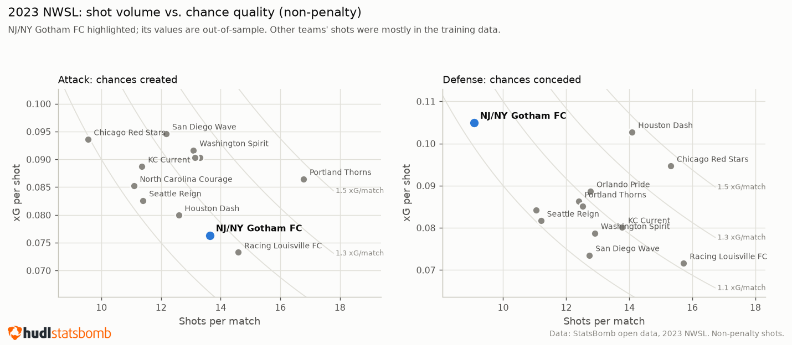
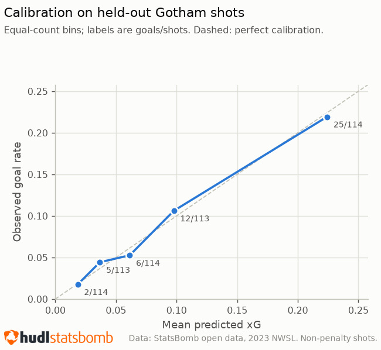
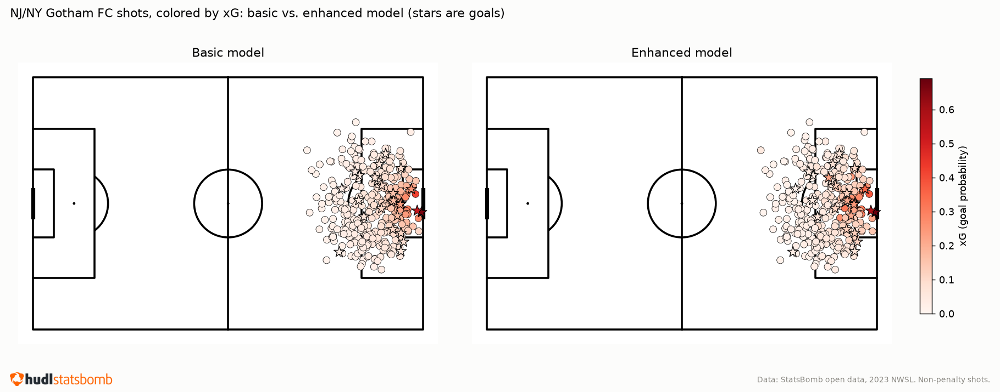
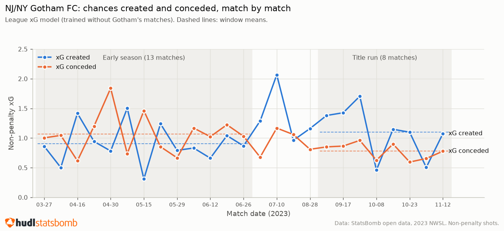
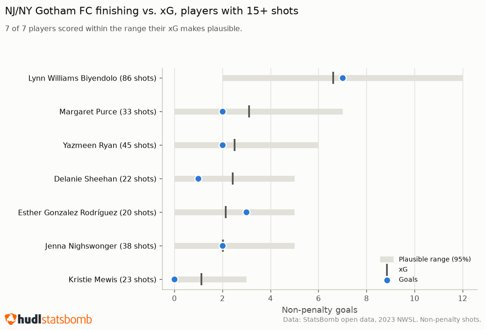
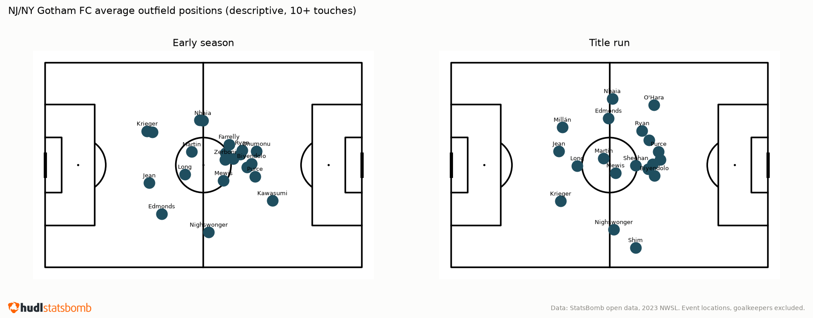

# Gotham 2023 xG review

**How good were the chances NJ/NY Gotham FC created and allowed in its 2023 NWSL title-winning season, graded by an xG model trained on the rest of the league?**

The modeling approach comes from [beyond-basic-xg](https://github.com/falkbrad-sudo/beyond-basic-xg), which shows on the full league sample that defender and goalkeeper positions from StatsBomb freeze frames improve on a distance and angle xG model. This repo does not re-argue that. It uses the model as a tool to review one team's season: chance quality, finishing, chances conceded, and how those changed between the first half of the season and the title run.



## In short

- **Few shots conceded, but good ones.** Gotham allowed **9.1 shots per match, the fewest in the league** (league median 12.8), but those shots had the **highest xG per shot in the league** (0.105; median 0.085). Overall it conceded 0.95 xG per match, 4th best of 12.
- **Volume over quality in attack.** Gotham took the 3rd-most shots per match (13.6) at the 2nd-lowest xG per shot (0.076), for a middling 1.04 xG per match (7th).
- **No finishing or goalkeeping luck story.** Gotham scored 26 non-penalty goals from 26.0 xG and conceded 24 from 23.8 xG. All 7 players with 15+ shots scored within the range their xG makes plausible.
- **A possible defensive improvement in the title run, not established.** xG conceded per match fell from 1.07 (13 early-season matches) to 0.78 (8 title-run matches), p = 0.013. With 5 comparisons the multiple-comparison threshold is 0.01, so none of them passes.

## How it works

1. **Data.** StatsBomb's free 2023 NWSL release (competition_id=49, season_id=107): 137 matches, 3,530 shots. Each shot event carries a **freeze frame**, the positions of the players in camera view at the moment of the shot (99% coverage). That is one snapshot per shot, not continuous tracking.
2. **Train on the rest of the league.** Logistic regression on distance, angle, defenders in the shooting cone and goalkeeper distance from the center of the goal, fit on the **2,920 non-penalty shots (249 goals) from the 112 matches Gotham did not play in**. No shot from a Gotham match, by either team, is in the training data.
3. **Grade Gotham.** Apply the model to Gotham's 341 non-penalty shots and the 227 it conceded. Because those matches were held out, every Gotham number is out-of-sample.
4. **Uncertainty.** Goals vs. xG totals come with the exact distribution of goals the shot-level xG values imply (a Poisson-binomial), which gives a 95% plausible range and a p-value. Player tables require 15+ shots and carry a Bonferroni flag. The season comparison uses Welch's t-tests on per-match values, with matches as the unit.

Penalties are excluded throughout: they are a fixed-location set piece with their own conversion rate. Goals here are non-penalty shot goals, so totals differ from the official score (no penalties, no own goals).

## Results

### The model holds up on Gotham

On the 568 held-out Gotham shots for and against (50 goals):

| | Basic (distance, angle) | Enhanced (+ defenders, keeper) | StatsBomb xG (reference) |
|---|---|---|---|
| AUC | 0.685 | **0.759** | 0.790 |
| Log-loss | 0.277 | **0.258** | 0.249 |
| Predicted goals (actual: 50) | 47.0 | **49.8** | 59.6 |

The enhanced model is well calibrated: in 5 equal-count bins its predicted and observed goal rates agree within about 1 percentage point. StatsBomb's own model ranks shots somewhat better but predicts about 10 goals too many on these shots.





Adding defender and keeper positions mostly re-sorts shots from the same areas: shots with an open lane or a keeper off their line move up, crowded ones move down.

### Season, match by match



| Per match | Early season (Mar to Jun, 13) | Title run (Sep to Nov, 8) | p |
|---|---|---|---|
| xG conceded | 1.07 | 0.78 | 0.013 |
| xG difference | -0.16 | +0.32 | 0.027 |
| xG created | 0.90 | 1.10 | 0.30 |
| Shots conceded | 9.7 | 8.3 | 0.10 |
| Shots | 13.5 | 13.8 | 0.89 |

The direction fits the title story: Gotham was out-chanced early (-0.16 xG per match) and out-chanced its opponents in the title run (+0.32), mostly through conceding less. But 13 and 8 matches are small samples and no comparison clears the threshold, so this is a lead, not a finding. The four July and August matches fall outside both windows (see `config.yaml`).

### Finishing



The 95% plausible range for the team's own 341 shots is 17 to 36 goals; it scored 26. For the shots it conceded, 16 to 33; it conceded 24. Lynn Williams, with by far the most shots (86), scored 7 from 6.6 xG.

### Team shape (descriptive)

Average position per outfield player (10+ touches) from event locations, early season vs. title run: team length 41.5 to 33.5 m, width 37.4 to 49.6 m (21 and 19 players). This is a pooled description with no significance test.


 A per-match version of the question in the companion project [entropy-of-transition](https://github.com/falkbrad-sudo/entropy-of-transition) (Welch's t-tests, Bonferroni-corrected, different windows and player selection) finds no robust change in Gotham's 2023 shape, so read these numbers as a description, not evidence that the shape changed.

## Limitations

- **One team, one season.** 50 held-out goals is enough to check the model and the team totals, not to make fine-grained claims about players or half-seasons.
- **League context is partly in-sample.** In the league table, only Gotham's row is out-of-sample. Other teams' shots were mostly in the training data, so their rows are context for ranking, not held-out estimates.
- **Freeze frames, not tracking.** Only players in camera view are captured, with no velocities. One Gotham shot has no goalkeeper in frame and is dropped.
- **Non-penalty shot goals only**, as above.

## Repo structure

```
gotham-2023-xg-review/
├── src/
│   ├── data/        # statsbomb_loader.py (API calls), cleaning.py (units, freeze frames)
│   ├── features/    # geometry.py, shot_context.py, formation.py
│   ├── models/      # league_model.py (held-out fit), grading.py (goals vs. xG, season tests)
│   ├── viz/         # review_plots.py, shot maps, formation plots
│   ├── pipeline.py  # fetch -> cache -> league model -> grade Gotham -> season tests
│   └── figures.py   # cached results -> reports/figures/
├── app/
│   └── streamlit_app.py   # Season, Finishing, Shots & model, Team shape tabs
├── reports/              # figures and the StatsBomb logo
├── notebooks/
│   └── 00_exploration.ipynb
└── tests/           # 45 unit tests (hand-checkable) + 6 integration tests
```

See `METHODOLOGY.md` for the analysis principles, code conventions and known pitfalls.

## Setup

```bash
python -m venv .venv && source .venv/bin/activate
pip install -r requirements.txt
python -m src.pipeline          # first run fetches ~137 matches from StatsBomb (a few minutes), then cached
python -m src.figures           # writes reports/figures/
streamlit run app/streamlit_app.py
```

## Testing

```bash
pytest -m "not integration"    # 45 tests, no network or data needed
pytest -m integration           # live StatsBomb checks + the app against cached results
```

## Data credit


Data provided by [StatsBomb](https://github.com/statsbomb/open-data) under their open data user agreement.
